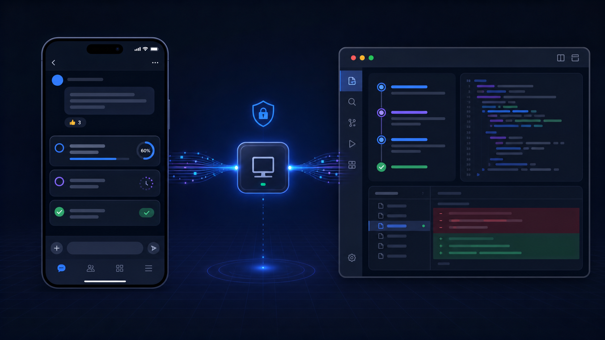
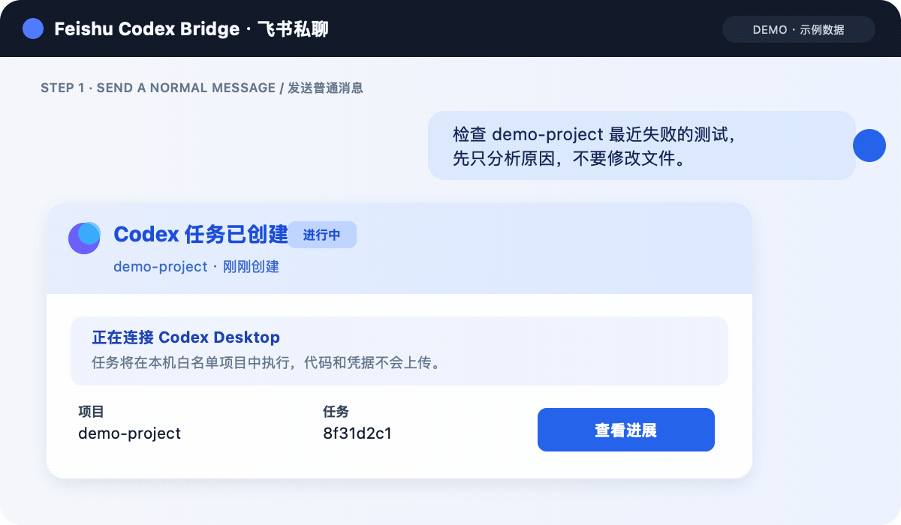
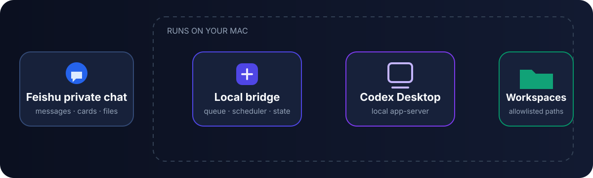

# Feishu Codex Bridge

<div align="center">

**Run Codex from Feishu. Keep execution on your Mac.**

A single-user, self-hosted companion for starting, monitoring, and continuing
Codex Desktop tasks from a Feishu or Lark private chat.

[Get started](docs/INSTALL.md) · [See how it works](docs/ARCHITECTURE.md) · [Usage guide](docs/USAGE.md) · [简体中文](README.zh-CN.md)

[](https://github.com/chengzeli7/feishu-codex-bridge/actions/workflows/ci.yml)
[](LICENSE)
[](CHANGELOG.md)

</div>



> **Public beta:** `v0.1.4` uses local app-server capabilities currently bundled
> with Codex Desktop. A future Codex update may require a compatibility update.

## What problem does it solve?

Codex Desktop works on your Mac, but you are not always sitting in front of it.
Feishu Codex Bridge turns a private bot chat into a lightweight task console:

1. Send a normal message from Feishu to start a Codex task.
2. Follow plans, commands, files, errors, and elapsed time in a task card.
3. Reply to the card to continue the same task with its existing context.
4. Receive a notification when the task finishes or needs you.

Your repository, Codex session, credentials, and execution state remain on the Mac.

## 20-second product tour



This is a reconstructed product demo with representative data—not a screenshot
of a real user or repository. Open the full-size frames:
[start a task](docs/images/demo-step-1.png) ·
[follow progress](docs/images/demo-step-2.png) ·
[get the result and continue](docs/images/demo-step-3.png) ·
[watch the 12-second launch video](docs/media/x-launch-demo.mp4).

## The three everyday workflows

| Start work remotely | Stay in the loop | Continue with context |
|---|---|---|
| Send a normal request or choose an allowlisted workspace. | Open the task list or detailed progress card without opening Codex Desktop. | Reply to a task card, or use an exact command when task selection must be deterministic. |
| `Check why the latest tests failed` | Plan · tools/MCP · commands · changed files · errors | `继续1 Add a regression test` |

The bridge also supports images, files, short voice messages, durable follow-up
queues, completion watches, and one-time, daily, or weekly local schedules.

## Is it for you?

| A good fit when you… | Choose something else when you… |
|---|---|
| use Codex Desktop regularly on a personal Mac | need Linux, Windows, or an always-on cloud runner |
| want to check or continue tasks from your phone | need full screen, mouse, or keyboard control |
| want code and credentials to stay local | need a shared multi-user or group-chat bot |
| are comfortable allowlisting specific projects | need unrestricted filesystem access |

## How it works



Feishu transports messages and renders cards. The bridge, queue, scheduler, Codex
runtime, and project files all run locally on your Mac. Read the
[architecture overview](docs/ARCHITECTURE.md) for task ownership and recovery details.

## Quick start

### Easiest: ask Codex to install it

Open a new Codex task on the target Mac and send this entire prompt:

```text
Install and configure Feishu Codex Bridge on this Mac by following:
https://github.com/chengzeli7/feishu-codex-bridge/blob/main/docs/CODEX_INSTALL.md
Read the guide and then execute it autonomously. Pause only when the guide says
that I must complete a browser, Feishu, macOS, or pairing action.
```

Codex downloads the project, uses a persistent Node.js runtime, runs guided
setup, installs the per-user background service, and verifies it. You only step
in for browser confirmation, Feishu app publication, macOS permission prompts,
and the one-time private-chat pairing message.

After installation, send these messages to the bot:

```text
健康
任务
Check this project for the latest failing test. Do not modify files yet.
```

Prefer installing it yourself? See the complete [installation guide](docs/INSTALL.md)
for Homebrew and source options.

### What to expect

| Item | Expectation |
|---|---|
| Typical setup time | About 5–15 minutes, depending on Feishu app publication |
| Automated | Download, dependency setup, local configuration, LaunchAgent, diagnostics |
| Requires you | Browser confirmation, Feishu app publication, macOS prompts, one pairing message |
| Installed data | `~/Library/Application Support/CodexFeishuBridge` |
| Logs | `~/Library/Logs/CodexFeishuBridge` |
| Removal | `feishu-codex-bridge uninstall` stops the service and preserves local data |

The installer preserves existing bridge state, Feishu profiles, Codex settings,
and project files. It does not change global Git configuration.

## Safety by design

- **Single user and private chat:** only the paired user and chat are accepted.
- **Workspace allowlist:** new tasks can start only in configured project paths.
- **No remote approval bypass:** Feishu-started turns use `approvalPolicy: never`.
- **Local credentials:** Feishu secrets and Codex credentials never belong in the repository.
- **Filtered progress:** raw reasoning, full tool arguments, terminal output, and common secrets are excluded or redacted.
- **No remote desktop:** the bridge cannot view the screen or control the mouse and keyboard.

Treat access to the paired Feishu account as access to the configured workspaces.
Review [SECURITY.md](SECURITY.md) before deployment.

## Current scope

| Supported | Not supported yet |
|---|---|
| macOS | Linux and Windows |
| One allowlisted Feishu user | Multiple users |
| Private bot chat | Group chat |
| Codex runtime bundled with ChatGPT Desktop | Cloud-hosted Codex routing |
| Allowlisted local workspaces | Arbitrary directory access |

The Mac must be awake and online. A sleeping or powered-off Mac cannot process
messages; this is a local bridge, not a cloud relay.

The current Feishu cards and deterministic commands are Chinese-first. Natural
language task prompts may be written in any language supported by Codex; full
card and command localization is planned for a later release.

## How is it different?

| Capability | Feishu Codex Bridge | Remote desktop | Generic chat bot |
|---|---|---|---|
| Structured Codex task progress | Built in | Visible only through the screen | Requires custom integration |
| Continue the same Codex task | Direct card reply or command | Manual Desktop interaction | Requires custom task binding |
| Code and credentials stay on the Mac | Yes | Yes | Depends on the bot architecture |
| Mobile interaction | Native Feishu cards | Streamed desktop UI | Chat only |
| Screen, mouse, and keyboard control | No | Yes | No |

## Compatibility

| Component | Current support |
|---|---|
| Operating system | macOS |
| Codex | Runtime bundled with ChatGPT Desktop |
| Node.js | 20, 22, and 24 are covered by CI |
| Feishu/Lark | Custom app, bot capability, private chat |
| `lark-cli` | Bundled dependency, currently `1.0.89` |

## Frequently asked questions

<table>
  <tr>
    <td width="50%" valign="top">
      <strong>Is this a cloud service?</strong><br><br>
      No. Feishu transports messages and cards; execution, queues, files, and credentials stay on your Mac.
    </td>
    <td width="50%" valign="top">
      <strong>Can it read every file?</strong><br><br>
      No. New tasks are restricted to allowlisted projects and remain subject to Codex and macOS permissions.
    </td>
  </tr>
  <tr>
    <td width="50%" valign="top">
      <strong>Why no reply after the Mac sleeps?</strong><br><br>
      There is no cloud relay. A sleeping or powered-off Mac cannot consume or execute messages.
    </td>
    <td width="50%" valign="top">
      <strong>Can one bot control several Macs?</strong><br><br>
      Use a separate Feishu app per Mac to avoid event-stream races, missed messages, or duplicate work.
    </td>
  </tr>
  <tr>
    <td width="50%" valign="top">
      <strong>Does group chat work?</strong><br><br>
      Not yet. The current single-user security model accepts only the paired private chat.
    </td>
    <td width="50%" valign="top">
      <strong>What if Codex needs approval?</strong><br><br>
      Remote turns use <code>approvalPolicy: never</code>. Handle extra permissions or human input in Codex Desktop.
    </td>
  </tr>
</table>

More answers and diagnostic steps are in [Troubleshooting](docs/TROUBLESHOOTING.md).

## Documentation

| Guide | What it covers |
|---|---|
| [Installation](docs/INSTALL.md) | Codex-managed, Homebrew, and source installation |
| [Usage](docs/USAGE.md) | Natural language, exact commands, attachments, schedules, and queues |
| [Configuration](docs/CONFIGURATION.md) | Allowlist, workspaces, bot profile, paths, and limits |
| [Architecture](docs/ARCHITECTURE.md) | Components, data flow, task ownership, and local-first design |
| [Troubleshooting](docs/TROUBLESHOOTING.md) | No replies, writer conflicts, stale cards, voice, and diagnostics |
| [Multiple Macs](docs/MULTI_MAC.en.md) | Why each Mac should use a separate Feishu app |
| [Codex-managed installer](docs/CODEX_INSTALL.md) | The autonomous installation contract used by Codex |

## Contributing

See [CONTRIBUTING.md](CONTRIBUTING.md). Do not open a public issue for a
vulnerability; follow [SECURITY.md](SECURITY.md) instead.

## License

[Apache License 2.0](LICENSE)

## Disclaimer

This is an unofficial community project and is not affiliated with or endorsed
by OpenAI, Feishu, Lark, or ByteDance. Codex, ChatGPT, Feishu, and Lark are
trademarks of their respective owners.
